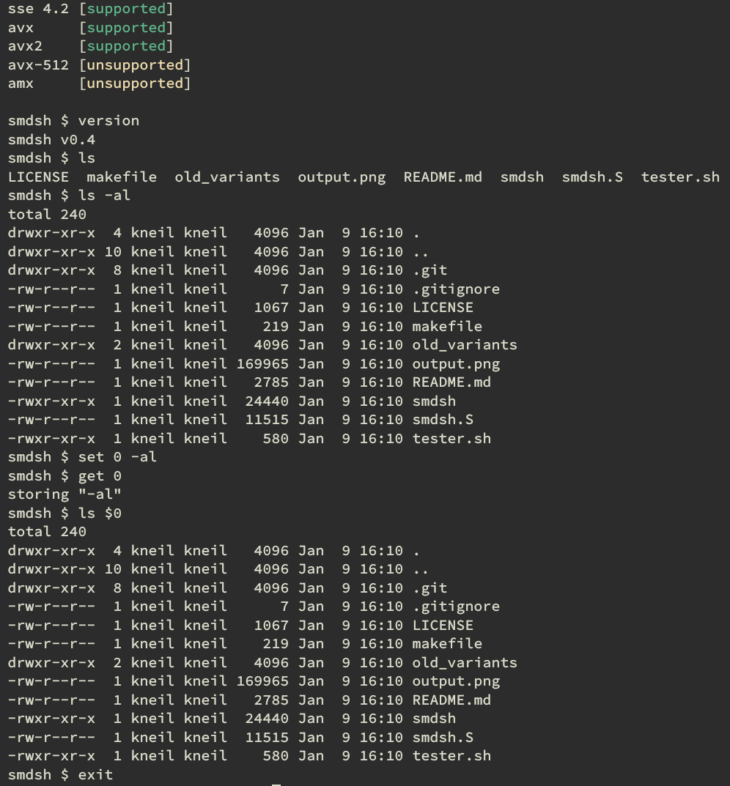

# smdsh

A shell that doesn't rely on stack or heap allocation.  Keep commands short; there isn't a lot of error checking here.

The assembly here is optimized for runtime size and makes fairly heavy use of GAS macros.  Not sure if that was a good idea or not.

## Building
Requires clang.
 - `make regular`: build without debug symbols
 - `make debug`: build with debug symbols

## Rules
1. No heap memory allocation (malloc, brk, mmap, new processes, etc.)
2. No stack allocation (meaning the adjustment of rbp or rsp)
3. No calling libraries that violate rules 1 or 2
4. Using memory that is already allocated at the start of the program is ok, but don't abuse it
5. Storing read-only data in .text is ok
6. No self-modifying code (slow and really hard to understand)

## Features
 - Uses the 128-byte red zone located after the stack pointer for passing data to `exec()` and nothing else
   - Wassup, [suckless](https://suckless.org/philosophy/)
 - Extensive use of x86 registers for storage
   - SSE 4.2, AVX, and AVX2 registers are all used to store and parse input for no particularly good reason
   - Shell options are stored in legacy x87 FPU stack registers
 - *Kinda* support for the following:
   - builtins
   - variable substitution
   - command line flag checking
   - environment variables (read only)

## Limitations
 - No Windows support as it doesn't have a red zone
 - x86 SIMD register width impacts maximum length of shell commands

## Example Output

## Notes
`old_variants` contains older versions of smdsh that didn't work for various reasons.
 - `smdsh_xmm_str.s` used SSE string processing instructions for everything, which was a huge hassle and hard to read and adjust.  Better method is to use regular cmp and mask instructions.
 - `smdsh_tight.s` packed all commands and args as tight as possible in XMM registers which made it really hard to do string processing or shifting without losing data.

### Memory map
|      | 0x0 - 0x8 | 0x9 - 0xF |
|------|-----------|-----------|
| 0x00 | **argv    | **argv    |
| 0x10 | **argv    | **argv    |
| 0x20 | **argv    | **argv    |
| 0x30 | **argv    | **argv    |
| 0x40 | argv[0]   | argv[1]   |
| 0x50 | argv[2]   | argv[3]   |
| 0x60 | argv[4]   | argv[5]   |
| 0x70 | argv[6]   | NULL      |

## TODOs
 - pipes/redirection
 - if statements
 - (possibly) using the following memory locations:
   - x87 float control/status registers
   - ymm0 - ymm15
   - zmm0 - zmm15 on machines with AVX512
   - AMX matrix registers (if I get access to a machine with this feature)
